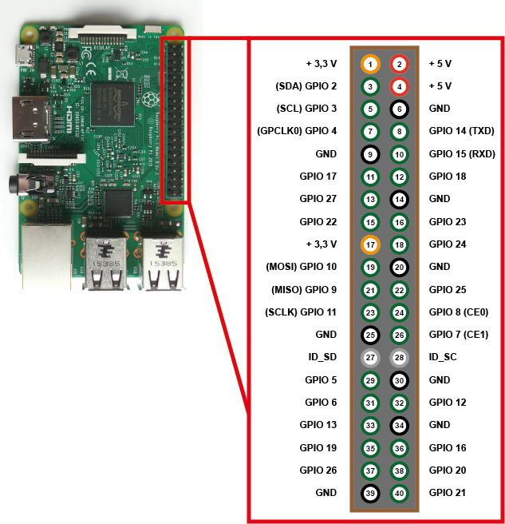

# Miniature World Great Canadian Railroad Exhibit
## About
This repo is a collection of files for configuration and installation of the [PiMediaSync](https://github.com/limbicmedia/PiMediaSync) application to run the **Great Canadian Railroad Exhibit** at [Miniature World](https://miniatureworld.com/), BC, Canada.

## Installation
The installation procedure for this project has been made as simple as possible. On a fresh installation of Raspbian, run:

```BASH
sudo su
export GCR_VERSION=v1.0.0 # the version you wish to install, must be 2.0.0 or greater 
wget -O - https://raw.githubusercontent.com/limbicmedia/mini-world-gcr-display/${GCR_VERSION}/setup.sh | bash
```

Steps for setting up Raspbian can be found [here](https://github.com/limbicmedia/PiMediaSync).

### Installation Details
The above installation command will:
* download and install `gcr_config.py`
* download and install `PiMediaSync` (based on the version found in [PIMEDIASYNC_VERSION](./PIMEDIASYNC_VERSION))
* enable `PiMediaSync` at boot (using `systemd`)

By default:
* `PiMediaSync` is installed in `/opt/pimediasync`
* Sawmill files are installed in `/root/gcr`

## Files
This repo contains 3 main files:

#### [setup.sh](./setup.sh)
This file is responsible for installing the entire project (including PiMediaSync) and configuring it to run at boot.

#### [PIMEDIASYNC_VERSION](./PIMEDIASYNC_VERSION)
This file sets the version of PiMediaSync which will be installed.

#### [gcr_config.py](./gcr_config.py)
This file is responsible for setting all of the necessary config variables in the PiMediaSync application. The core functionality of the exhibit is encoded in this file.

## Interaction
The exhibit runs automatically in a loop. A single toggle switch is setup to enable/disable the autorepeat function for the installation. In practice this means at boot the switch is read by the software and sets the installations state: running or paused.

The paused mode keep the default value of the lights on high. Useful for providing light to the installation when work needs to be done.

### Switch Wiring
The diagram below shows the circuit wiring for the button.
The internal pull-up in the Raspberry PI handles the 

The switch is wired between `pin 39` and `pin 40` of the Raspberry PI. The ordering of the wires does not matter.

<br>
